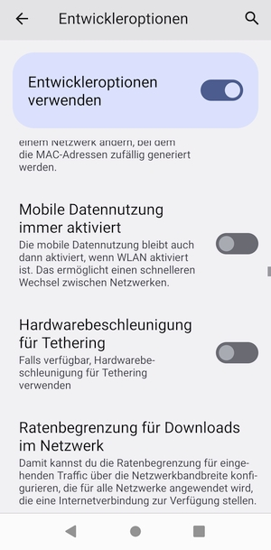
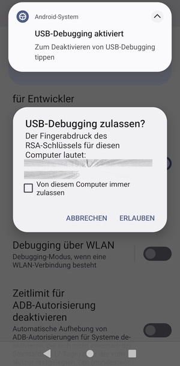

# Android Backup mit adb

Um ein Backup von allen Daten auf dem Android zu machen, gibt es eine sehr schnelle Möglichkeit mit den _adb Tools_. Dazu wird das Handy per USB an einen PC angeschlossen. Bei diesem Backup werden alle Dateien auf den PC kopiert und die Ordner auf dem Android geleert. Du hast dann also null Fotos, null Musik und null Dokumente auf dem Android. Doch Achtung: Profis können auch gelöschte Daten wiederherstellen. Doch Ottilie Normalverbraucherin kann das nicht, zumindest nicht ohne weitere Kenntnisse. 

Das Backup ist eine gute Gelegenheit, mal Tabula Rasa auf deinem Handy zu machen und wieder Platz zu schaffen.

Das Backup machst du mit der ADB, der Android Debug Bridge.

Hinweis: Du kannst mit dem ADB deinem Android ernsthafte Schäden zufügen. Bitte benutze diese Anleitung nur, wenn du dir absolut sicher bist, was sie tut und du dir im klaren darüber bist, dass du eigenverantwortlich handelst. Nur du allein klickst auf etwas und machst etwas, nur du allein bist für dein Handeln verantwortlich.

Fangen wir an.

Lade dir die [ADB Tools](https://developer.android.com/studio/releases/platform-tools) auf deinen PC runter.

Die nachfolgende Anleitung ist für Windows-Benutzende geschrieben.

Lies die Bedingungen und Konditionen der ADB Tools und bestätige sie.

---

---

Wenn du einverstanden bist, mache einen Haken an *I have read and agree with the above terms and conditions* und klick auf **Download Android SDK Platform-Tools for Windows**.

---

---

Drücke in deinem Browser auf der Tastatur **STRG + J**. Es öffnet sich ein Fenster, welches deine Downloads zeigt. Klick mit einem Rechtsklick auf die platform-tools. Klick auf **In Ordner anzeigen** (das ist bei jedem Browser etwas unterschiedlich)

---

---

Diese Datei befindet sich in deinem Download-Verzeichnis.

---

---

Übrigens: Eine .zip-Datei ist ein Archiv, quasi wie ein Koffer. Und aus diesem Koffer werden gleich die Dateien entpackt. Klicke mit einem Rechtsklick auf die Datei. Aus dem Kontextmenü wählst du nun **Alle extrahieren...** aus. Nun wirst du gefragt, wohin du die Datei extrahieren möchtest. Klicke auf **Extrahieren**.

---

---

Hier befindet sich nun der Ordner _platform-tools_. 

---

---

Klicke unterhalb vom Ordner mit einem Rechtsklick in die leere Fläche. Das Kontextmenü öffnet sich. Wähle **Neu ► Textdokument**. Das Textdokument ist blau markiert. Klicke einmal neben die Datei irgendwo auf die leere Fläche. Doppelklick dann auf das Textdokument. Es öffnet sich der Editor.

---

---

Markiere folgenden Code mit der Maus, klick Rechtsklick ► Kopieren und im Textdokument dann Rechtsklick ► Einfügen.

---

<pre>
@echo off
cls
echo Los geht es. Druecke eine Taste.
pause >nul
cd platform-tools
::Verbindung generieren
adb logcat -c

echo ....................Hole DCIM....................
adb pull "/storage/emulated/0/DCIM/" ../
adb shell rm -rf /storage/emulated/0/DCIM/
adb shell mkdir /storage/emulated/0/DCIM/
echo ...ok.

echo ....................Hole Documents....................
adb pull "/storage/emulated/0/Documents/" ../
adb shell rm -rf /storage/emulated/0/Documents/
adb shell mkdir /storage/emulated/0/Documents/
echo ...ok.

echo ....................Hole Download....................
adb pull "/storage/emulated/0/Download/" ../
adb shell rm -rf /storage/emulated/0/Download/
adb shell mkdir /storage/emulated/0/Download/
echo ...ok.

echo ....................Hole Movies....................
adb pull "/storage/emulated/0/Movies/" ../
adb shell rm -rf /storage/emulated/0/Movies/
adb shell mkdir /storage/emulated/0/Movies/
echo ...ok.

echo ....................Hole Music....................
adb pull "/storage/emulated/0/Music/" ../
adb shell rm -rf /storage/emulated/0/Music/
adb shell mkdir /storage/emulated/0/Music/
echo ...ok.

echo ....................Hole Pictures....................
adb pull "/storage/emulated/0/Pictures/" ../
adb shell rm -rf /storage/emulated/0/Pictures/
adb shell mkdir /storage/emulated/0/Pictures/
echo ...ok.

echo ....................Hole Podcasts....................
adb pull "/storage/emulated/0/Podcasts/" ../
adb shell rm -rf /storage/emulated/0/Podcasts/
adb shell mkdir /storage/emulated/0/Podcasts/
echo ...ok.

echo ....................Hole Recordings....................
adb pull "/storage/emulated/0/Recordings/" ../
adb shell rm -rf /storage/emulated/0/Recordings/
adb shell mkdir /storage/emulated/0/Recordings/
echo ...ok.

echo ....................Hole Ringtones....................
adb pull "/storage/emulated/0/Ringtones/" ../
adb shell rm -rf /storage/emulated/0/Ringtones/
adb shell mkdir /storage/emulated/0/Ringtones/
echo ...ok.

echo ....................Syslogs loeschen....................
adb logcat -c

echo ...ok.
::Verbindung beenden
adb kill-server
cd ..
echo Fertig. Bitte eine Taste druecken.
pause >nul
</pre> 

---

---

Klicke auf **Datei ► Speichern unter...** 

---

---

Trage bei Dateiname **"copy.bat"** ein. Achte darauf, die Anführungszeichen zu machen! Klicke dann auf **Speichern**.

---

---

Jetzt hast du also den Ordner _platform-tools_ eine Datei namens _copy.bat_ und _Neues Textdokument.txt_. 

---

---

Das Textdokument kannst du löschen. Klicke das Textdokument an, drücke auf deiner Tastatur **SHIFT + ENTF** und bestätige den Löschen-Dialog mit **Ja**.

---

---

Schließe nun dein Handy per USB-Kabel an deinen PC an, am besten an einen USB 2.0 Anschluss. Gehe in die Einstellungen deines Handys, in dem du mit einem Finger von oben nach unten wischt und das Zahnrad-Symbol drückst.

---

---

Scrolle nun so weit hinab, bis dort »Über das Telefon« steht. Klicke dort drauf.

---

---

Scroll runter und klicke **8 mal** auf **Build-Nummer**. Jetzt hast du die **Entwickleroptionen** frei geschaltet.

---

---

Gehe im Menü zurück zum Punkt **System**. Dort gibt es nun die **Entwickleroptionen**. Klicke da drauf.

---

---

Der Schalter für **Entwickleroptionen verwenden** ist **aktiviert**.

---

---

Wo du schon mal hier bist, kannst du auch noch etwas nützliches einstellen. Scroll runter zu **Mobile Datennutzung immer aktiviert**.

---

---

Deaktiviere den Schalter. Ab jetzt hast du eine wesentlich längere Akkulaufzeit. Denn mobile Daten sind erst dann aktiviert, wenn du es willst und nicht, wenn dein Handy das für richtig hält.

---

---

Scroll weiter runter zu **USB-Debugging**. Aktiviere den Schalter.

---

---

Eine Warnmeldung poppt auf. Lies sie durch und bestätige mit **OK**.

---

---

Nun siehst du eine Informationsnachricht ganz oben auf deinem Bildschirm. **USB-Debugging ist aktiviert**.

---

---

Jetzt geht es los. Dein Handy ist mit dem PC verbunden. Starte nun die **copy.bat** in dem Ordner, den du vorhin auf deinem PC erstellt hast. Folge den Anweisungen auf deinem Bildschirm am PC. Nun wirst du gefragt, ob du das **USB-Debugging zulassen** möchtest. Bestätige mit **ERLAUBEN**.

---

---

Nun rattert das Backup-Script durch dein Handy durch. Hinweis: Manchmal kann es lange dauern, dann steht dort: _Building File list_. Warte unbedingt ab! Zieh nicht am Kabel! Lass das Handy in Ruhe! Lass es einfach ganz in Ruhe durchlaufen. Sonst könnten Dateien beschädigt werden.

---

Nachdem in der **copy.bat** steht: **fertig.** und du eine Taste gedrückt hast, schließt sich das Script automatisch. Dein Backup ist dann fertig. Du kannst das Handy wieder vom Kabel entfernen. Gehe wieder in die Entwickleroptionen. (Einstellungen ► System ► Entwickleroptionen).

---

---

**Deaktiviere** den Regler **USB-Debugging**.

---

---

### Zusammenfassung:

Du hast dir Entwickler-Tools für dein Android heruntergeladen. Du hast eine Batch-Datei in Windows erstellt, die automatisch deine Daten vom Handy herunterläd und die Ordner leert. Du hast die Entwickleroptionen im Handy frei geschaltet und USB-Debugging aktiviert. Das erstellte Script hat die Daten auf deinen PC kopiert und die Ordner auf dem Handy geleert (technisch korrekt: nachdem die Daten heruntergeladen wurden, wurden die Ordner auf dem Handy gelöscht und neue Ordner mit gleichem Namen erstellt). Danach hast du das USB-Debugging wieder deaktiviert.

Du hast nun die Daten auf dem PC, aber nicht mehr auf dem Handy.

Hinweis: Gelöscht ist nicht gelöscht. Auch wenn Daten gelöscht werden (am PC oder auf dem Handy), sind sie nicht weg: Sie stehen dem System »zur Überschreibung bereit«. Doch so lange sie nicht überschrieben werden, lassen sie sich auch wieder herstellen. Das Backup-Script, das du hier verwendet hast, verschafft dir wieder Platz auf dem Handy. Es hindert Ottilie Ottonormalverbraucherin daran, falls dein Handy _abhanden_ kommen sollte, Daten auf deinem Handy zu finden. Technisch versierte Menschen können aber deine gelöschten Bilder und Dokumente und andere Daten wieder herstellen. Verlass dich also nicht auf das Backup-Script.
