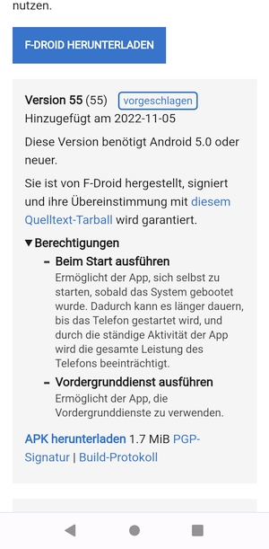
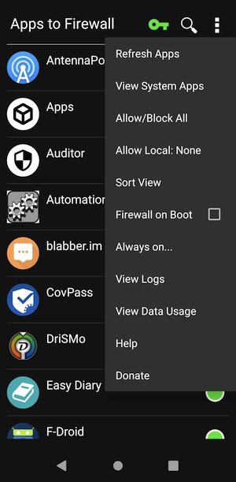
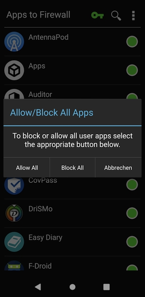

# Karma Firewall
**Eine Firewall für Android Handys**

[Karma Firewall](https://f-droid.org/de/packages/net.stargw.fok/) aus dem F-Droid-Store herunterladen.

----

---

Hinab scrollen und auf das oberste **APK herunterladen** klicken.

----

---

Nun die Abfrage mit »Trotzdem herunterladen« bestätigen.

----

---

Jetzt oben auf **Öffnen** klicken.

----

---

In dem Hinweisfeld nun auf **Einstellungen** klicken.

----

---

**Dieser Quelle vertrauen** aktivieren.

----

---

**Installieren** klicken.

----

---

Die Firewall wird nun installiert.

----

---

**ACHTUNG!** Jetzt auf **FERTIG** klicken. 

----

---

Danach den Schieberegler von _Dieser Quelle vertrauen_ wieder **deaktivieren**. 

Nun die App starten. 

Oben rechts auf den **roten Schlüssel** drücken. 

----

---

Mit einem Klick auf **OK** bestätigen.

----

---

Auch hier einmal **OK** drücken.

----

---

Nun kann ausgewählt werden, welche Apps ins Internet dürfen und welche nicht. 

Grüner Punkt = Internetzugang, roter Punkt = darf nicht ins Internet.

----

---

Mit einem Klick auf das **3-Punkte-Menü** oben rechts öffnet sich das Menü.

Klicke **View System Apps** an.

----

---

Hier kann ausgewählt werden, welche System-Apps ins Internet dürfen. Hinweis: Eine Deaktivierung des Internetzugangs für System-Apps kann die Funktion des Android erheblich beeinträchtigen: Updates können nicht mehr geladen werden, Die zwei wichtigen Apps [NINA](https://www.bbk.bund.de/DE/Warnung-Vorsorge/Warn-App-NINA/warn-app-nina_node.html) und [NORA](https://www.nora-notruf.de/de-as/startseite) funktionieren nicht mehr richtig und auch andere Apps, die auf Push-Benachrichtungen durch Google angewiesen sind, könnten nicht mehr ordnungsgemäß funktoinieren oder seltsam reagieren.

----

---

Ein Klick auf das **3-Punkte-Menü**. 

Wähle **Allow/Block All**.

----

---

Und nun wähle **Block All** (_Allow All_ erlaubt alle Apps).

----

---

Alle System-Apps kommen nun nicht mehr ins Internet.

----

---

Wähle wieder das **3-Punkte-Menü**.

Klick auf **View User Apps**.

----

---

Klick nun wieder auf **Allow/Block All**.

----

---

Nun auf **Block all** (_Allow All_ erlaubt alle Apps).

----

---

Wähle die Apps und System-Apps aus, die ins Internet dürfen. Klick dafür einfach auf einen roten oder grünen Punkt, um den Punkt von rot auf grün oder von grün auf rot umzuschalten.

Grüner Punkt = Internetzugang, roter Punkt = darf nicht ins Internet.

----

---

In diesem Beispiel habe ich den von mir verwendeten Apps [Threema](http://shop.threema.ch) und [Zapp](https://f-droid.org/de/packages/de.christinecoenen.code.zapp/) einen Zugang zum Internet erlaubt.

Mit _Threema_ kann ist ein verschlüsseltes Chatten möglich.
Mit _Zapp_ können die öffentlich-rechtlichen Mediatheken durchsucht werden und die Videos angesehen werden.

----

---

Einstellungen → Netzwerk & Internet → VPN → Karma FW → Zahnrad-Symbol drücken → **Durchgehend aktives VPN** anwählen

----

---

Falls vorhin bei der Installation vergessen wurde, dem Browser die Berechtigung _Installieren unbekannter Apps_ wieder zu entziehen, ist es folgendermaßen lösbar:

---

Gehe in die Einstellungen. Bei _Einstellungen suchen_ **unbekannt** eingeben.

----

---

Nun auf **Installieren unbekannter Apps** klicken.

----

---

Runter scrollen zu **Installieren unbekannter Apps** und diesen Menüpunkt anklicken.

----

---

Nun runter scrollen zum Namen vom Browser und den Namen vom Browser anklicken.

----

---

Jetzt den Schieberegler von _Dieser Quelle vertrauen_ **deaktivieren**

----

---

Dem Browser sind nun die Rechte entzogen worden, unbekannte Apps zu installieren. 

----

---

Die Firewall ist nun einsatzbereit. 

Gutes Gelingen!
