# Imagepipe

## Intro
Jedes mal, wenn du ein Foto mit deinem Handy machst, speichert dein Handy zusätzliche Daten in die Bilder hinein. Die Uhrzeit und das Datum der Aufnahme, die Kameraeinstellungen, dein Handymodell und, falls du die Standortdaten aktiviert hast, speichert es auch oftmals die GPS-Daten in die Bilder hinein. Das bedeutet: Schickst du einer fremden Person aus dem Internet ein Selfie, weiß diese Person eventuell schon in Bruchteilen von Sekunden, wo du dich gerade befindest.

## Nutze Imagepipe

Diese Anleitung zeigt dir, wie du _Imagepipe_ installierst. Das ist eine einfache App für *Android*-Handys. Diese App verkleinert die Bilder und löscht all diese zusätzlichen Daten (auch EXIF-Tags genannt). Imagepipe findest du im F-Droid-Store. Das ist so ähnlich wie der Google Playstore. Im F-Droid-Store gibt es viele Apps, die von einer eigenen Community entwickelt werden.

1) Öffne [die Seite von Imagepipe](https://f-droid.org/de/packages/de.kaffeemitkoffein.imagepipe/) in deinem Browser auf dem Handy.

---

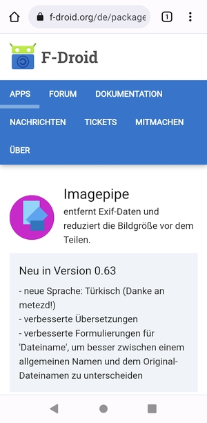

---

2) Scroll hinunter bis zum grauen Kasten, dessen erstes Wort mit **Version** beginnt. Zum Zeitpunkt, als diese Anleitung erstellt wurde, hatte _Imagepipe_ die Version 0.63 (42). 

---

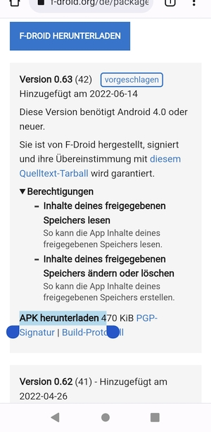

---

3) Klick auf **APK herunterladen**.

---

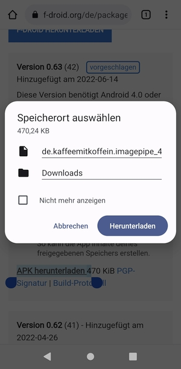

---

4) Speicher die Datei in deinem Downloadordner ab und klick auf **Herunterladen**.

----

5) Dein Handy wird dir nun eine Warnung anzeigen, die ungefähr so klingt: _»Diese Datei könnte schädlich sein. Möchtest du de.kaffeemitkoffein.imagepipe_42.apk trotzdem herunterladen?«_ Ja, du möchtest. Klick auf **Trotzdem herunterladen**. Übrigens: *Imagepipe* wurde programmiert von *kaffeemitkoffein* und eine &ast;.apk ist eine Android-Installationsdatei.

----

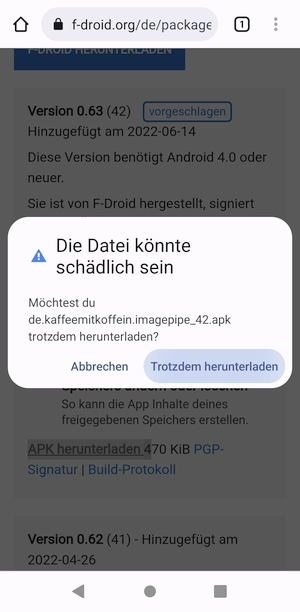

----

6) Nun folgt eine Sicherheitswarnung von deinem Browser (in den meisten Fällen _Chrome_; hier ist es der Browser _Vanadium_). Die Sicherheitsmeldung lautet: _»Aus Sicherheitsgründen kannst du auf deinem Smartphone zurzeit keine unbekannten Apps aus dieser Quelle installieren. Das kannst du in den Einstellungen ändern.«_ Klicke auf **EINSTELLUNGEN**.

---

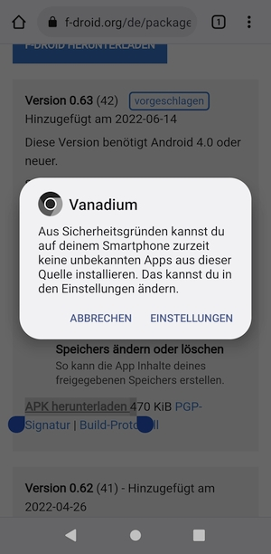

---

Nun kommst du zu einer Übersichtseite: _Installieren unbekannter Apps_. Aktiviere den Regler **Dieser Quelle vertrauen**.

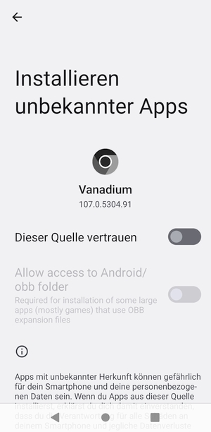

---

Nun wirst du gefragt, ob du _Imagepipe_ installieren möchtest. Klick auf **INSTALLIEREN**.

---

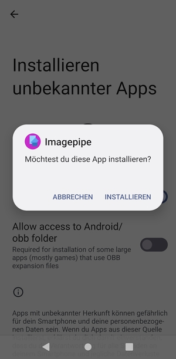

---

Nach erfolgreicher Installation bekommst du die Nachricht »Imagepipe App wurde installiert«. **ACHTUNG!** klicke nun auf **FERTIG**.

---

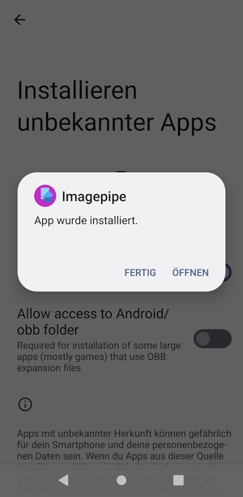

---

Denn jetzt **deaktivierst** du den Schieberegler **Dieser Quelle vertrauen**

---

---

_Imagepipe_ erscheint nun als kleines Bild auf deinem Startbildschirm. Klick auf das Bild von _Imagepipe_. 

---

Die App öffnet sich. Klick [OK] bei dem blauen Hilfsdialog.

---

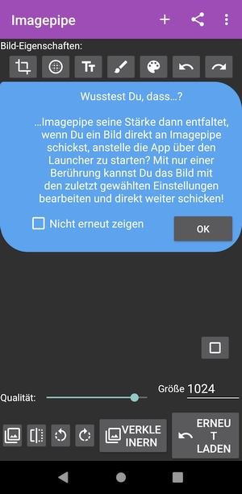

Bevor du zukünftig ein Bild teilst, teilst du es zuerst mit _Imagepipe_, von dort aus teilst du es dann weiter. Du kannst die Größe des Bildes hier ändern. Ein kleineres Bild bedeutet, es wird schneller versendet. Mach es nur nicht zu klein, sonst erkennt man auf dem kleinen Bild nichts mehr. _Größe 800_ ist super. Das sind 800 Pixel, also Bildpunkte groß. Das reicht meist gut aus. Editiere den Wert, wenn dir danach ist. _Größe 1024_ ist üblicherweise voreingestellt. Links daneben ist ein Schieberegler. Damit kannst du die Qualität des Bildes einstellen. Je geringer die Qualität, desto weniger Speicherplatz braucht das Bild und kann noch schneller übertragen werden. Du kannst die Qualität auch voll nach rechts aufdrehen.

---

---

Schreibe **800** neben die Größe.

---

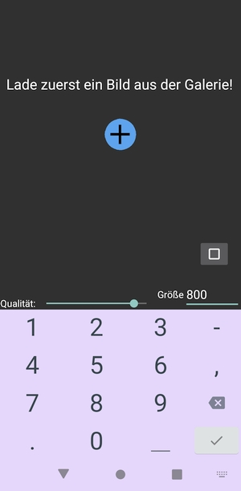

---

Klick nun auf das runde **Plus +** in der Mitte der App.

---

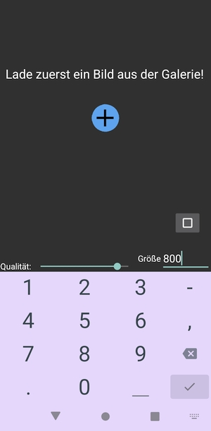

---

Falls du mehrere Galerie-Apps hast, wähle die App, die du gerne verwendest.

---

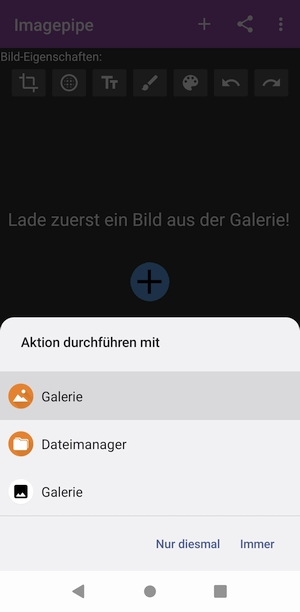

---

Wähle nun ein Bild aus deiner Galerie aus.

---

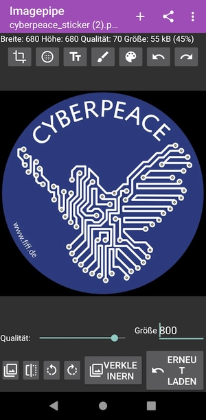

---

Oben ist eine Menü-Leiste mit Schaltflächen. Klicke auf die ganz linke Schaltfläche. Damit kannst du ein Bild beschneiden. Diesen zusätzlichen Schritt _kannst_ du machen, wenn du möchtest.

Markiere den gewünschten Ausschnitt, indem du mit geschlossenen Zeigefinger und Daumen auf den Bildschirm drückst und dann Daumen und Zeigefinger voneinander weg öffnest und dadurch einen Rahmen ziehst.

---

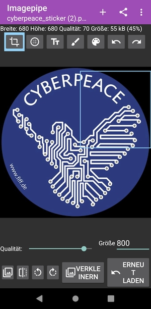

---

Du hast nun einen Bildausschnitt gewählt.

---

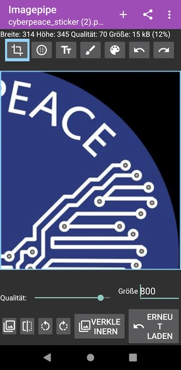

---

Du bist nun bereit, das Bild zu teilen. Klick ganz oben rechts in der Menüleiste auf das Teilen-Symbol (die drei Punkte, die durch eine Linie verbunden sind). Beim allerersten Mal wirst du nun noch gefragt: _»Imagepipe erlauben, auf Foto-, Video, Musik- und Audiodateien auf diesem Gerät zuzugreifen?«_. Klick auf **ZULASSEN**.

---

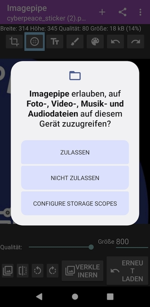

---

Nun kannst du die App auswählen, mit der du das Bild teilen möchtest.

--- 

### Zusammenfassung:
Du hast _Imagepipe_ aus dem _F-Droid-Store_ installiert. Du hast _Imagepipe_ eingerichtet und weißt nun, wie du _Imagepipe_ bedienen kannst.

### Abkürzung:
Und jetzt kommt der Clou: Wenn du ein Foto gemacht hast, das du teilen möchtest, dann teile es zuerst mit _Imagepipe_. Augenblicklich öffnet sich dann das _Teilen mit-Feld_ nochmals neu. Imagepipe hat das Bild jetzt schon verkleinert und von den versteckten Zusatzinformationen (EXIF-Tags) befreit.

### Viel Spaß beim sicheren Teilen von Bildern 🙂